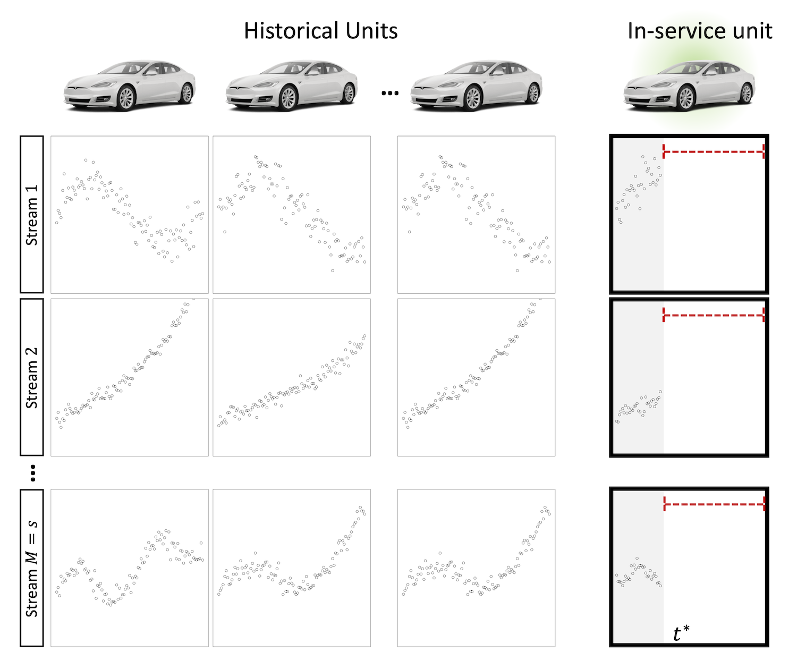
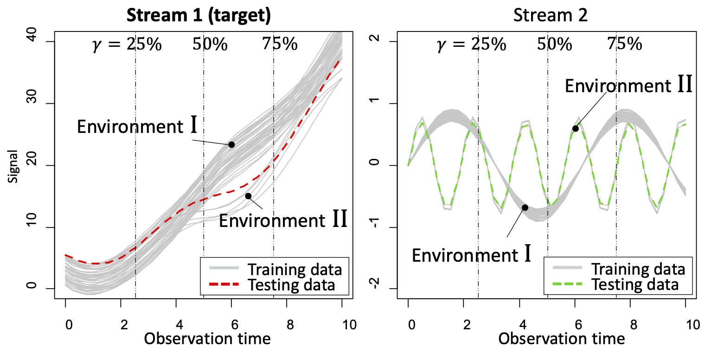
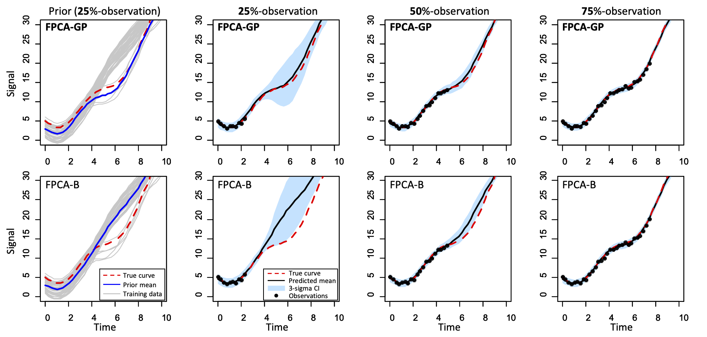

# Functional Principal Component Analysis for Extrapolating Multistream Longitudinal Data

This repository includes R code for FPCA-GP proposed in the paper "[Functional Principal Component Analysis for Extrapolating Multistream Longitudinal Data](https://ieeexplore.ieee.org/abstract/document/9258998)" by [S. Chung](https://sites.google.com/site/schungkorea/) and R. Kontar. 

The advance in modern sensor technologies enables the collection of multistream longitudinal data where multiple signals from different units are collected in real-time. Here the model aims to predict the future evolution of multistream signals from an in-service unit based on historical data from other units previously operated. For more details, please see the [paper](https://ieeexplore.ieee.org/abstract/document/9258998).



When you use this code, please cite the paper as follows:
```
@article{chung2020functional,
  title={Functional Principal Component Analysis for Extrapolating Multistream Longitudinal Data},
  author={Chung, Seokhyun and Kontar, Raed},
  journal={IEEE Transactions on Reliability},
  volume={70},
  number={4},
  pages={1321--1331},
  year={2020},
  publisher={IEEE}
}
```


## Usage
Please run _Simulation.R_ to get results. 

The code performs a simulation where 50 units generate two streams of signals. One stream represents environmental information of each unit (e.g., voltage, temperature, etc.) while the other is the target stream we want to extrapolate (e.g., degradation). Two distinct environments, Environment I (45 units) and II (5 units), are considered. The in-service unit is operated under Environment II, where fewer units are involved, resulting in a more challenging task.

The simulation data generated by the code is illustrated as follows:



The code makes predictions at the three phases of real-time observation (25%, 50%, and 75% of the entire time horizon), illustrated as follows:



## Applications
Our model can be useful in various relevant applications where multistream data is acquired. Some examples include:
- Vital health signals from patients collected through wearable devices
- Multistream battery degradation signals from cars on the road
- Energy usage patterns from different smart home appliances
